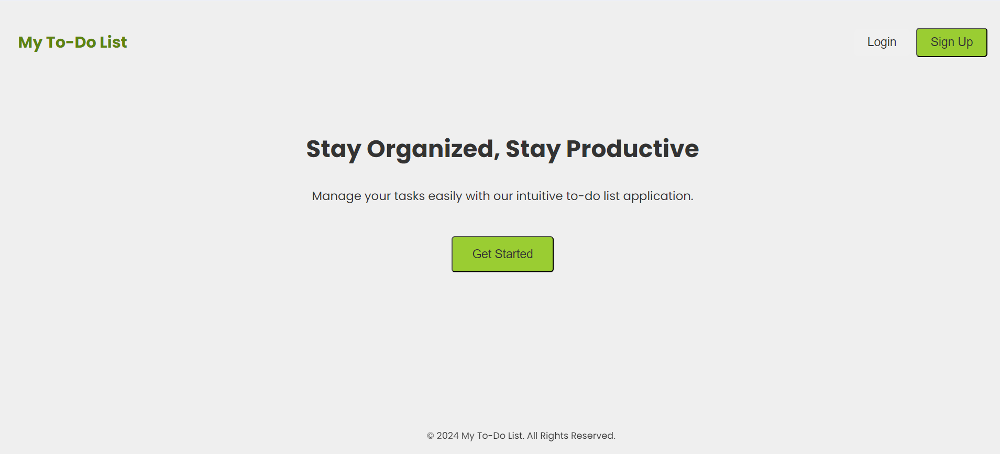
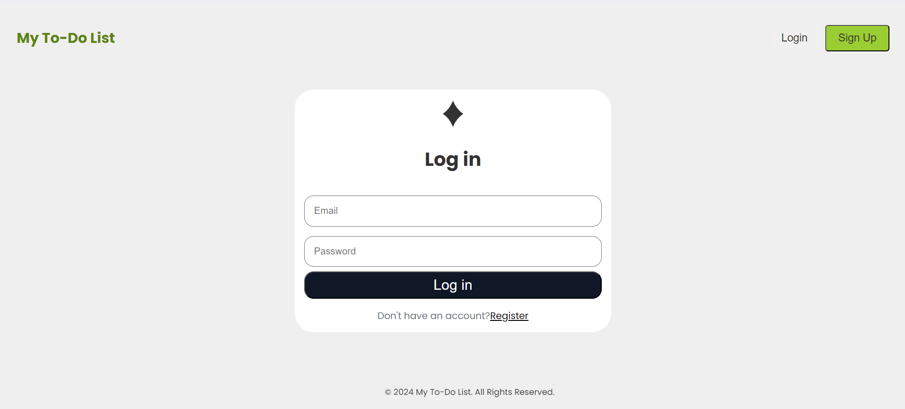
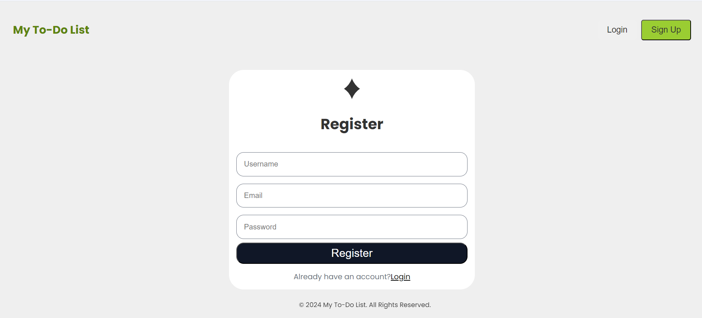
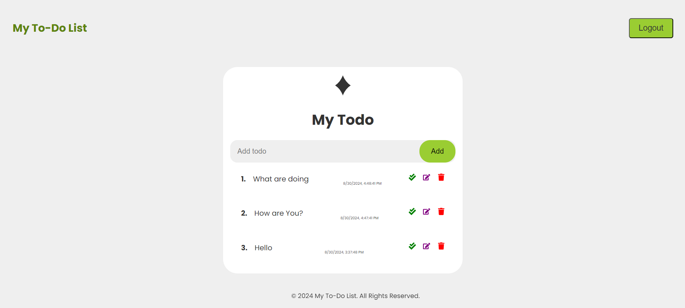

# MERN To-Do App with JWT Authentication

This is a full-stack To-Do List application built using the MERN (MongoDB, Express.js, React, Node.js) stack. The app allows users to create, update, and delete tasks while offering user authentication through JSON Web Tokens (JWT).


cd backend
```
npm i
node index.js
```


cd frontend
```
npm i
npm run dev
```

.env for frontend

```

VITE_APP_BACKEND_URL= '<YOUR_BACKEND_URL>'
```

.env for backend

```

MONGO_URI='<YOUR_MONGO_URL>'
FRONTEND_URI='http://localhost:5173/'
PORT=8080
JWT_SECRET='<YOUR_SECRET>'
NODE_ENV='development' 
```

## Screenshots

### Landing Page


### Login


### Register


### Todo
